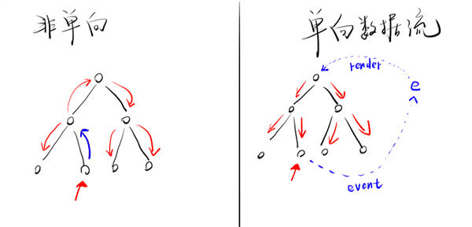

> 这里是我学习 React 过程中的一些 demo，记录于此， 方便查看。
> 
> 如果你打开链接发现怎么也运行不了，请在 JavaScript 代码那一栏重新选择一下语法， JSX(React)

# 组件通信

## 父子/爷孙通信：龟兔赛跑  

[在线链接](https://jsbin.com/pasefiw/edit?html,js,output)

要点：

父组件要传数据给子组件很简单，直接放在 props 里即可

子组件要传递数据给父组件就复杂点：

1. 父组件将一个函数 fn 作为子组件的 props 传给子组件

2. 子组件在恰当的时候调用这个 fn，并且把数据放在 fn 的参数里

## 任意组件通信：eventHub / Redux

